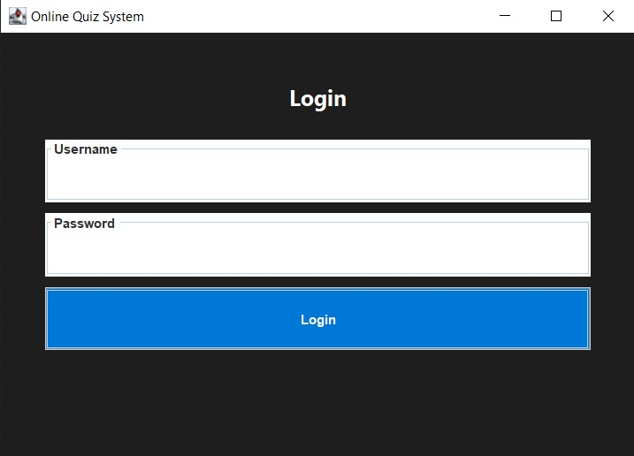
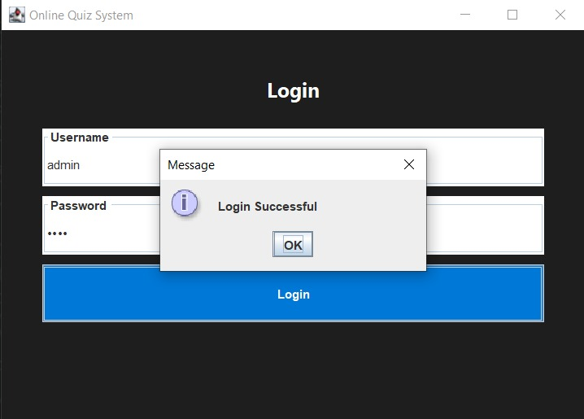
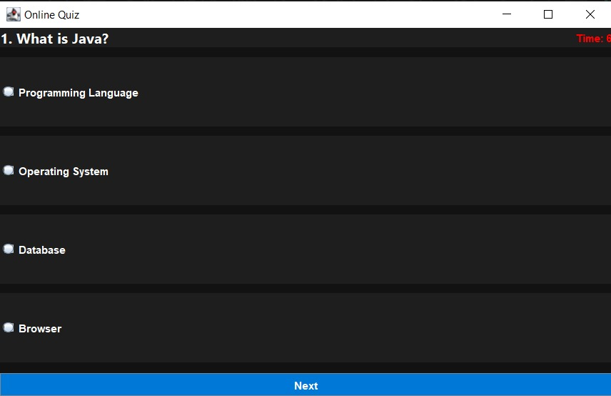
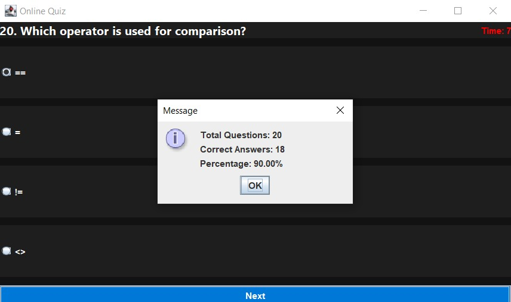
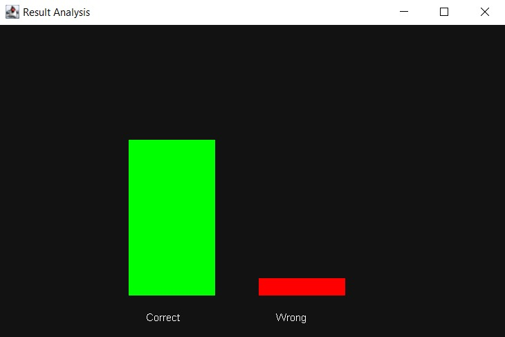

# 🎯 Online Quiz and Examination System

A modern Java-based desktop application designed to conduct quizzes with real-time evaluation, timer-based questions, and graphical result analysis. This project demonstrates strong implementation of Object-Oriented Programming (OOP), file handling, and GUI development using Java Swing.

---

## 🚀 Features

* 🔐 Secure Login System using file-based authentication
* ❓ Multiple Choice Questions (MCQs)
* 🔀 Randomized Question Order
* ⏱ Countdown Timer for Each Question
* 📊 Graphical Result Analysis (Bar Chart)
* 📈 Score Calculation with Percentage
* 💾 File-based Data Storage (No Database Required)
* 🎨 Modern Dark-Themed UI using Java Swing

---

## 🛠 Technologies Used

* **Java (Core Java)**
* **Java Swing (GUI Development)**
* **Object-Oriented Programming (OOP)**
* **File Handling (Text Files)**

---

## 📂 Project Structure

```
OnlineQuizSystem/
│
├── src/                     # All Java source files
│   ├── Main.java
│   ├── LoginUI.java
│   ├── QuizUI.java
│   ├── ResultUI.java
│   ├── FileService.java
│   ├── AuthService.java
│   ├── Question.java
│   ├── User.java
│
├── data/                    # Input data files
│   ├── users.txt
│   ├── questions.txt
│
├── screenshots/             # Project screenshots
│   ├── login.png
│   ├── quiz.png
│   ├── timer.png
│   ├── result.png
│   ├── chart.png
│
├── README.md
├── .gitignore
```

---

## ▶️ How to Run the Project

### Step 1: Open terminal in project folder

```
cd OnlineQuizSystem
```

### Step 2: Compile all Java files

```
javac -d . src/*.java
```

### Step 3: Run the application

```
java Main
```

---

## 🔑 Demo Credentials

```
Username: admin
Password: 1234
```

---

## 📸 Screenshots

### 🔐 Login Screen



---

### 📝 Credintial Verification



---

### ⏱ Quiz Interface



---

### 📊 Final Result



---

### 📈 Graph Analysis



---

## 📊 Sample Output

* Total Questions: 20
* Correct Answers: 15
* Percentage: 75%

Graph Representation:

* ✅ Correct Answers (Green Bar)
* ❌ Wrong Answers (Red Bar)

---

## 🚀 Future Enhancements

* 🗄 Integration with MySQL Database
* 🏆 Leaderboard System
* 📝 User Registration Module
* 📱 Web-based Version (Spring Boot)
* 📊 Advanced Analytics (Pie Chart, Reports)
* 🌐 Deployment as Web Application

---

## 🎯 Learning Outcomes

* Practical implementation of Java OOP concepts
* GUI development using Swing
* Event handling and timer management
* File handling for persistent storage
* Debugging real-world issues (timers, UI flow)

---

## 👨‍💻 Author

* Your Name

---

## ⭐ GitHub

If you like this project, consider giving it a ⭐ to support the work!

---

